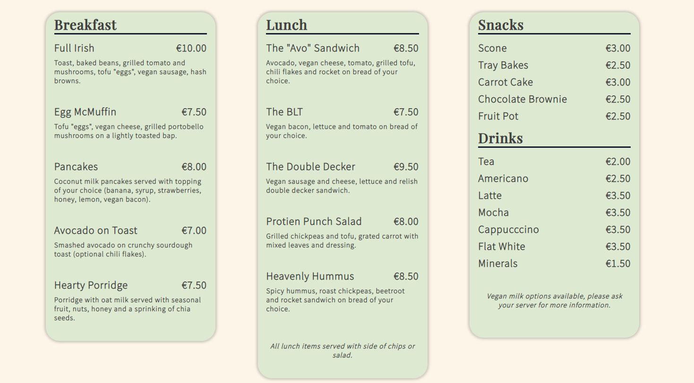

# The Vegan Van

(Created by Anna Walsh)

[Follow this link to access the website.](https://shecodeseire.github.io/portfolio-project-1/)

 

## Introduction

The Vegan Van is a food truck that serves vegan dishes to local customers and tourists exploring the Wild Atlantic Way. The van is based in Dunfanaghy, Co. Donegal. This small business promotes the use of fresh, local produce and has a strong commitment to sustainability. The website offers new and returning customers three fresh and inviting pages to explore. Customers can learn more about the company’s mission and ethos, read previous reviews, review the menu, obtain directions and contact the company if required.  

## Table of Contents
* User Experience 
* Features
* Design
* Technologies Used
* Testing 
* Deployment 
* Credits

## User Experience 

### User Stories 
This website is targeted at both new and returning customers and considered three key client groups. These groups represent the customers most likely to engage with the business and website. 

**User Group A: Local community members.** 

User Story: Sarah is a busy mum of three living in Co. Donegal. She is proud of her local area and loves to support her community and engage in local initiatives. Sarah requires a business that is child friendly, serves as a meeting point for friends and provides healthy lunch options for her children.

**User Group B: Tourists exploring the Wild Atlantic Way.**

User Story: Jonah is a retired policeman touring Donegal in a campervan with his wife. Jonah requires a business where he can sit down outdoors and enjoy a coffee with a view. He seeks to immerse himself in his environment and meet the locals. 

**User Group C: Outdoor Adventurers.**

User Story: Richard is a surfing enthusiast. He requires a business where he can enjoy a hot drink and sweet treat after a long and exhausting morning battling the Atlantic swell. He is very health conscious and cares about the environment and sustainability. 

### Website Objectives 

**Business Owner Goals:**

When developing the website, the business owner hopes to achieve the following;

- Clearly outline the company’s mission and ethos to potential and existing customers. 
- Provide contact details for customers to submit questions/queries/feedback. 
- Outline clear directions to ensure all customers can locate the business. 
- Exhibit menu options in a concise and inviting manner. 
- Build trust with customers by sharing positive reviews from previous clients. 
- Connect with customers online and grow a customer base by sharing social media links. 

**New Customer Goals:**

When using the website, new customers hope to achieve the following; 
-	Identify menu options and prices. 
-	Understand the business’s ethos and values. 
-	Locate the business. 
-	Identify opening and closing hours. 

**Existing Customer Goals:**

When using the website, existing customers may hope to achieve the following; 
- Contact the business with questions or queries. 
- Identify social media links.
- Review menu options and prices. 

**User Expectations:** 

- A responsive site that can be viewed across screen sizes.
- Simple and intuitive navigation.
- Links that open as expected. 
- A clean and professional layout. 
- A design that matches the business’s values and brand. 
- Good accessibility. 

## Features 

### Existing Features

The following features are evident across all three site pages: 

**Logo:**
The logo comprises of a simple icon located to the left of the business name. It is responsive and will reduce in size on smaller screens. It also serves as a link to the landing page. 

**Navigation Bar:**
The navigation bar provides links to the home, menu and contact pages. It is styled in a clean and minimalistic manner and allows users to intuitively navigate between site pages. This feature is fully responsive and will float to the left on smaller screens. 

**Footer:**
The footer provides several key features; 
- Address: Note that the “Address” heading serves as a link to the business’s location on google maps. This link opens in a new tab to avoid customers leaving the site without a means of returning. 
- Opening Hours: This allows customers to quickly and easily identify opening and closing hours for the business. 
- Phone Number: This allows customers to contact the business owners directly if required. 
- Email and Location icons: These icons change size and colour when hovered over. The email icon serves as a link to the contact page allowing users to easily navigate the website and contact the business directly. The location icon opens the google maps location of the business in a new tab.
- Social Media icons: Four social media icons open key social media websites in a new tab. These icons also change colour and size when hovered over. All icons contain aria labels to maintain accessibility. 

#### Landing Page Features: 

**Hero Image and Cover Text:** The hero image displays an image of a Volkswagen Van, providing immediate context for the site user. The text overlay includes a catchy slogan to add to the professionalism of the site and helps the site user to better understand the company’s brand. The hero image includes a zoom effect to add visual appeal. 

**Welcome Section:**
This section was designed for skim reading and allows the user to quickly learn about the business’s purpose, mission and value for customers. This section contains a link to the menu page. This link is styled as a button and changes colour when hovered over. 

**Flip Cards:**
Two eye-catching flip cards encourage the user to interact with the site and provide key information regarding the company’s commitment to sustainability and community service. These cards are fully responsive and will re-position from a row to column layout on smaller screens. 

**Reviews:**
This section allows the user to learn more about previous customer’s experiences with the business. A second link styled as a button allows the user to intuitively navigate to the menu page. 

#### Menu Page Features: 

**Menu Panels:** 
Three clean and concise panels provide information on the business’s set menu and pricing. The menu items are organised with information hierarchy in mind; breakfast items are presented first, followed by lunch items and finally drinks and snacks. Each menu item has a creative name to add interest for the user. These panels are responsive and will re-arrange to a column format on smaller screens. There is a strong contrast between the text and background colour to enable easy reading for visually impaired site users. 

**Contact Page Link:** A call to action is included below the menu panels, allowing the user to easily navigate to the contact page. This link changes in size and colour when hovered over. 

#### Contact Page Features: 

**Background Image:** This page contains a background image that remains in place as the user scrolls through the page to add visual appeal. The image reflects the business’s brand as an establishment that values the environment and is situated along the Wild Atlantic Way. 

**Contact Form:** The contact form enables the user to contact the business directly. Users are required to fill out all four sections before the form can be submitted successfully. For computers and laptops, the arrow changes to a pointer when the “send” button is hovered over. 

**Map:** A large google map of the business’s location is included at the bottom of the contact page. Users can zoom in and out of the map and drag the map to move it around on the screen. 

### Features Not Yet Implemented

**About Us:** The website could benefit from an additional page providing information on the business owners and their reasons for setting up the business. There is also an opportunity to provide more information on local suppliers and the benefits of acquiring ingredients locally. 
**Online Orders:** There is scope for an online ordering feature that would allow customers to place their order online prior to their visit to reduce waiting times.

## Design

Wireframes: 

This site was designed using pen and paper sketches initially followed by wireframes created using [Balsamiq](https://balsamiq.com/wireframes/?gclid=CjwKCAjwzY2bBhB6EiwAPpUpZiC_r2yCcRAPVgL-qLMz8Ii7YTAcwitZP7q-l_gcA9LcTbEchPfaQxoCLG8QAvD_BwE). Please find a selection of the completed wireframes below; 

**Sample 1 : Landing Page (for mobile devices)**

 
 

**Sample 2 : Menu Page (for desktop)**

 
 

**Sample 3 : Contact Page (for desktop)**

 

### Typography: 

This website uses the following two fonts;
- [Playfair Display.](https://fonts.google.com/specimen/Playfair+Display/about?query=play)
- [Source Sans Pro.](https://fonts.google.com/specimen/Source+Sans+Pro/about?query=Source+sans+pro)

These fonts were selected for their readability and simplistic style. This font pairing was inspired by the following [blog post](https://www.creativebloq.com/typography/20-perfect-type-pairings-3132120) written by Ruth Hamilton. 

### Imagery: 

All images were obtained from the [Unsplash website](https://unsplash.com/) and compressed using [Compress JPG](https://compressjpeg.com/) to improve page loading times. The hero image on the landing page represents a VW van, providing immediate context to the user. The flip card images attempt to demonstrate the healthy, colourful meals available for purchase. Finally, the background images on the menu and contact pages convey beautiful scenery to reflect the business’s surroundings. 

### Colour Scheme: 

The colour scheme includes earthy, neutral and inviting tones. This creates a relaxed atmosphere and reflects the brand identity as an environmentally conscious business. Links, buttons, and backgrounds are styled using the same colours to create a consistent experience for the user. 

## Languages 

This website was developed using [HTML](https://en.wikipedia.org/wiki/HTML) and [CSS](https://en.wikipedia.org/wiki/CSS).

**Other resources utilised:**
- [Balsamiq](https://balsamiq.com/wireframes/?gclid=CjwKCAjwzY2bBhB6EiwAPpUpZk0S7N9dTBqOmMjucEl-RaHrCALaWfywQkMhjhyDnrqvvjzUIS_84xoCNJwQAvD_BwE)
- [Github](https://github.com/)
- [Gitpod](https://www.gitpod.io/?utm_source=googleads&utm_medium=search&utm_campaign=dynamic_search_ads&utm_id=16501579379&utm_content=dsa&gclid=CjwKCAjwzY2bBhB6EiwAPpUpZh-ASwOdf27vGLxUADgOCQDDFsIZEXFEJC_wF99ftbfAkiIxmDDV4BoCzBMQAvD_BwE)
- [Font Awesome](https://fontawesome.com/) 
- [Google Fonts](https://fonts.google.com/)
- [Chrome Developer Tools](https://developer.chrome.com/docs/devtools/)
- [Website Mockup Generator](https://websitemockupgenerator.com/)
- [Google Maps Generator](https://google-map-generator.com/)

## Testing 

**Responsiveness:** 
This site was tested for responsiveness using chrome developer tools. Media queries were added for six breakpoints to cater for a wide range of screen sizes. Four breakpoints were selected using current best practice guidelines set out by [W3Schools](https://www.w3schools.com/css/css_rwd_mediaqueries.asp). An additional two breakpoints were selected to solve a specific sizing issue relevant to the site in question. 

Please find a summary of the main changes added at each breakpoint below: 

**Max-width 1300px:** This breakpoint was used to improve the layout and content of the menu panels for larger screens. 

**Max-width 992px:** At this breakpoint, the menu panels and flip cards both switch to a column layout for easy reading on smaller screens. This breakpoint was also used to modify the layout and styling of the nav menu and contact form for smaller screens. 

**Max-width 768px:** Both the reviews section and primary containers on the contact page switch to a column layout for improved readibility. Of note, at this breakpoint the contact form container displays first, followed by the contact information container to ensure that the most important information is displayed first for site user. The size of several headings and sections of text is reduced to improve readibility on smaller screens. 

**Max-width 600px:** Text size reduces and the footer container switches to a "wrap" layout. 

**Max-width 583px:** This breakpoint was included to solve a bug within the navigation bar. Without this media query, there is an excess of padding above the navigation bar on small screens.  

**Max-width: 480px:** Font size is reduced for text within the menu panels for mobile devices. The containers within the contact page are styled to fit more neatly on mobile screens. 

During the testing phase, this site was successfully loaded on a several mobile devices, an i-pad, a small laptop and a large desktop screen.

**Browser Testing**

This browser was tested for functionality on the following browsers with nil issues identified:
- Mozilla Firefox
- Bing
- Microsoft Edge
- Google Chrome 

**Validation Testing**

The W3C Markup Validation Service was used to test the html code for the home, menu and contact pages.  Some errors were noted initially and minor changes were made to the code, including the following;

- Several h1 elements were changed to h2 elements to ensure that only on h1 element existed per page. 
- Two id selectors responsible for styling the front of the landing page flip cards were switched to class selectors. This ensured that no duplicate ids existed within the code. Additional styling was then added to the front of each flip card using two separate unique id selectors.
- Two duplicate id selectors responsible for styling the button links on the landing page were switched to class selectors. 

Following these changes, nil errors reported were reported for all html code. 

The CSS code was tested using the W3C Jigsaw Validation Service. Nil errors were noted. 

**Performance Testing** 
The Lighthouse performance tool was used to test all pages and the results are as follows;

**Home Page:** 

**Menu Page:**

**Contact Page:**

Of note, performance scores were reduced due to large network payloads. Images, font and icon downloads contributed to this. All images were compressed to improve loading times. The performance score could be improved upon in the future by reducing network payloads and serving images in more modern formats such as WebP and AVIF. 

**Manual Testing**

Please find a summary table of all manual testing completed below: 

 

 

**User Goals Testing**
Please find a review of each user goal below and a summary of how the website meets these requirements. 

**New Customer Goals:**

1. "Identify menu options and prices."
    - Clear pricing information available on menu panels. 
    - Strong colour contract between text and background colour on menu panels improves readability. 
    - Home page provides several links to menu page ensuring intuitive navigation to desired information. 
     
     

2. "Understand the business’s ethos and values."
    - Welcome section provides overview of business's value to customers. 
    - Flip card section contains clear, concise overview of the business's ethos and values. 
    - Design reflects the business's appreciation of nature and the enviornment. 
      
      

3. "Locate the business."
    - Footer section contains written address and several links to google maps location. 
    - Large, interactive map available on contact page. 
      
      

4. "Identify opening and closing hours." 
    - Footer section clearly outlines this information on every page. 

**Existing Customer Goals:**

1. "Contact the business with questions or queries."
    - "Contact" link in navigation bar allows for easy navigation to contact details. 
    - Intutivie and concise contact form provided on contact page. 
    - Phone number provided in footer. 
    - Link to contact page provided in footer. 
  
  

2. "Identify social media links."
    - Easily recognisable social media icons listed in footer. 
    - Each icon directs user to social media page in new tab. 
  
  

3. "Review menu options and prices."
    - Comprehensive menu listed on menu page. 
    - Links to menu in navigation bar and on home page allow for intuitive navigation to desired information. 

**User Expectations Testing ** 

1. "A responsive site that can be viewed across screen sizes."
    - Site is fully responsive and can be viewed across all screen sizes.
       
      

2. "Simple and intuitive navigation."
    - Clean and concise navigation bar on all pages. 
    - All links are styled with the same colour scheme enhancing intuitive navigation. 
    - Multiple links to new pages available on each page.
      
       

3. "Links that open as expected."
    - All links performed as expected on manual testing. 
     
     

4. "A clean and professional layout."
    - Consistent colour scheme throughout website. 
    - Minimal text to allow for skim reading. 
    - Information presented in hierarchial manner. 
      
      
    
5. "A design that matches the business’s values and brand."
    - Consistent theme of earthiness/health within colour scheme/imagery selected. 
      
      

6. "Good accessibility."
    - All image tags include alt attributes.
    - Aria-labels included for ambiguous links e.g. icon links to social media. 
    - Title attribute included in iframe. 
    - Strong contrast in text colour versus background colour to improve readability. 
    - Responsive design allows site to be accessed across devices. 
      
      

## Deployment

This website was deployed using GitHub Pages. The following steps were taken to deploy the site; 
1. Open the relevant GitHub repository.
2. Navigate to the "Pages" subheading, within the "Code and Automation" settings section. 
3. Select the "main" branch from the source dropdown menu. 
4. Click save. 

The site was then deployed and a URL was created by GitHub Pages. 

[Follow this link to access the website.](https://shecodeseire.github.io/portfolio-project-1/)

## Unfixed Bugs

There are currently no known bugs left unfixed within the website. 

## Credits

1. All images were obtained from [Unsplash](https://unsplash.com/): 
- The image of the Cliffs of Moher was taken by Henrique Craveiro. Link to his Unsplash profile [here.](https://unsplash.com/@hocraveiro)
- The VW van hero image was taken by Caleb George. Link to his Unsplash profile [here](https://unsplash.com/@seemoris)
- The flip card food images were taken by Ella Olsson (flip card one) and Sarah Dubler (flip card two). Links to their Unsplash profiles [here](https://unsplash.com/@ellaolsson) and [here.](https://unsplash.com/@ahungryblonde_)
- The image of grass and mountains on the menu page was taken by Ales Krivek. Link to his Unsplash profile [here.](https://unsplash.com/@aleskrivec)

